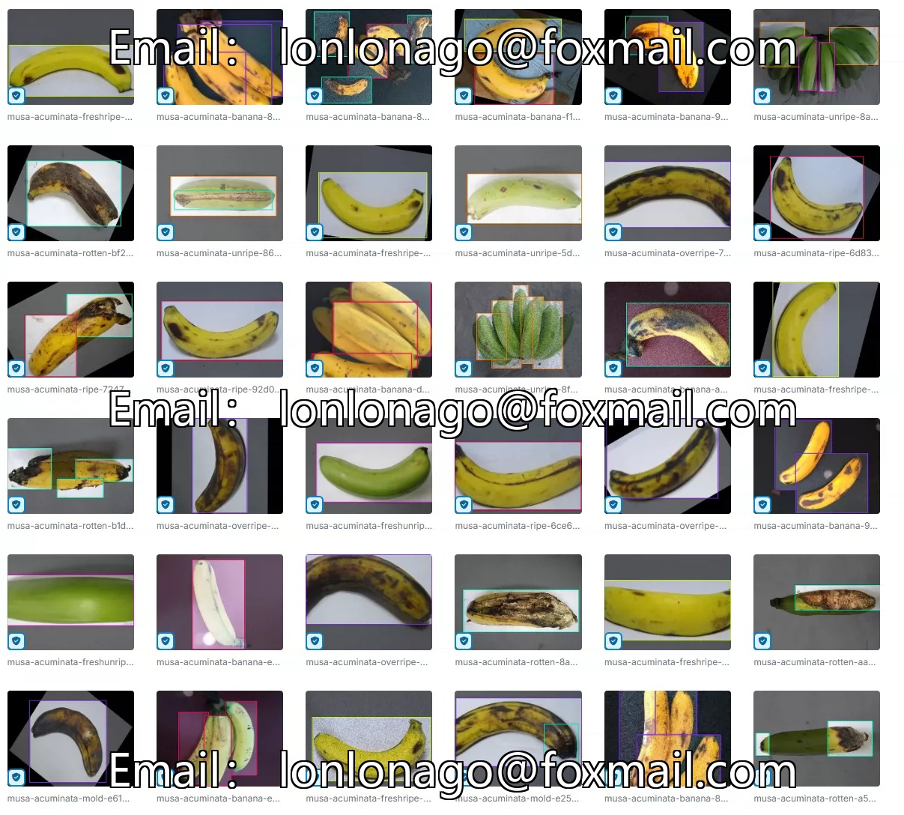
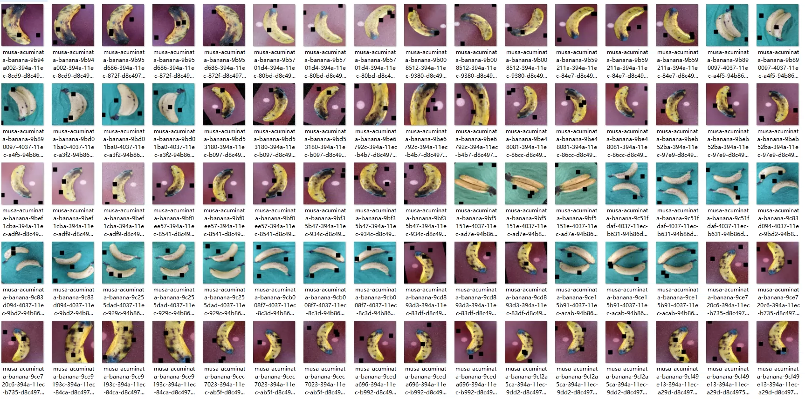
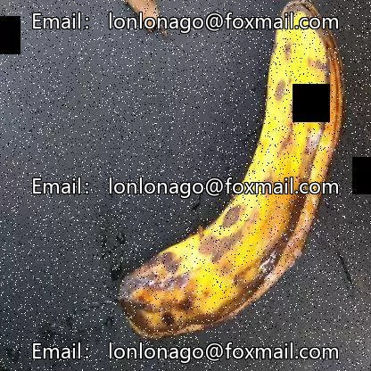
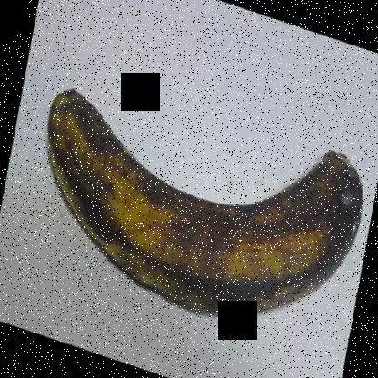
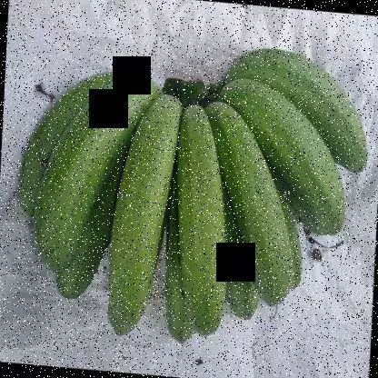
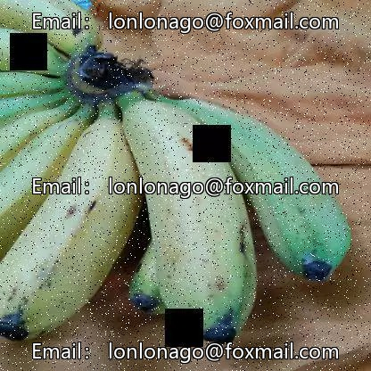

## Body

（Agricultural Product）Banana Maturity Detection Dataset in YOLO format

Totally 17,000 images, each labeled separately.
Divided into 6 categories: 'freshripe', 'freshunripe', 'overripe', 'ripe', 'rotten', 'unripe'
"Fresh unripe", "Fresh unripe (status)", "Overripe", "Ripe", "Rotten", "Unripe"

Electronic virtual products sold are not returnable.

## Images

Here is a pay link on Stripe ( https://buy.stripe.com/3cs8yP7sY87d0vu9AB ). Please contact me lonlonago@foxmail.com after funding $89, and I will send you a complete data files , thank you!

